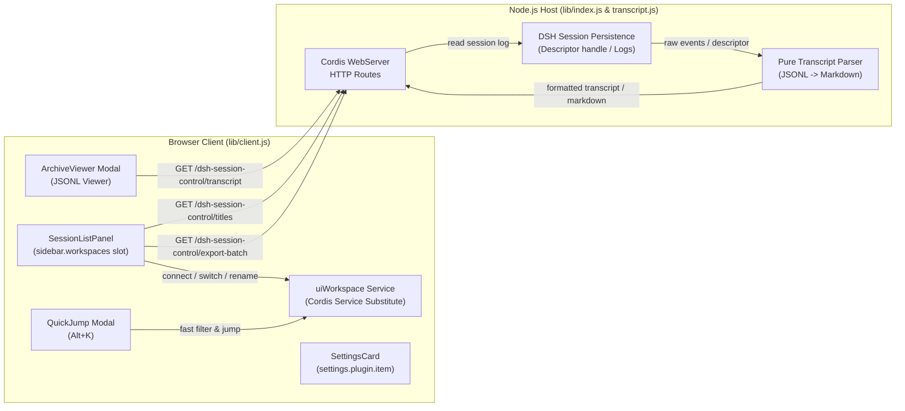

# 📦 @goodandready/dsh-session-control

<div align="center">

<h3>Advanced Sidebar Session Management, Pinning, Full-Text Search & Transcripts Viewer for DeepSeek Harness</h3>

<p align="center">
  <a href="https://www.npmjs.com/package/@goodandready/dsh-session-control"></a>
  <a href="LICENSE"></a>
  <a href="https://github.com/topics/dsh-plugin"></a>
  <a href="https://nodejs.org"></a>
</p>

<!-- Showcase Button -->
<p align="center">
  <a href="https://goodandready.app/"></a>
</p>

<p align="center">
  <a href="README.md"><b>🇬🇧 English</b></a> •
  <a href="README.zh.md"><b>🇨🇳 中文说明</b></a> •
  <a href="README.ru.md"><b>🇷🇺 Русский</b></a>
</p>

<!-- Mandatory project support block -->
<table align="center">
  <tr>
    <td align="center">
      ⭐ <strong>If you like this plugin, please star it on GitHub</strong> — it shows me that the plugin is useful to you and motivates me to keep developing it.
      <br><br>
      🐛 <strong>If you find a bug or would like to request a feature</strong>, open a GitHub issue in any language — I will review your proposal and implement useful suggestions in a future plugin version.
    </td>
  </tr>
</table>

</div>

---

## What the Plugin Does to the Sidebar

The plugin **replaces the body of the sidebar** — the section containing the workspace and session lists. The rest of the sidebar remains completely stock: branding, the new session button, footer, and navigation to settings remain untouched.

Replacement is intentional and architecturally required: the `sidebar.workspaces` slot is declared by the harness core as `kind: "single"`, which does not allow secondary registrants, and no other extension slots exist in the sidebar body.

---

## Architecture & Data Flow



## Comparison: Stock Sidebar vs. dsh-session-control

| Capability | Stock Sidebar | With `dsh-session-control` |
|---|---|---|
| **Pin Conversations** | ❌ None | ✅ Global pinned section at the top of the sidebar |
| **Archive Section** | ❌ Completely hidden | ✅ Dedicated section grouped by time periods |
| **Read Archived Sessions** | ❌ Impossible | ✅ Read-only full transcript viewer modal |
| **Search Results** | ⚠️ Title only | ✅ Title + contextual match snippet preview |
| **Blank Sessions** | ⚠️ Mixed with active ones | ✅ Hidden automatically (except current active session) |
| **Bulk Actions** | ❌ None | ✅ Multi-selection with checkboxes and Shift+Click ranges |
| **Reversible Hiding** | ❌ Only irreversible archive | ✅ Reversible one-click hide / unhide |
| **Active Session Indicator** | ❌ Not indicated | ✅ Live running pulse dot in row |
| **In-Place Rename** | ⚠️ Modal prompt | ✅ Inline double-click or F2 edit |
| **Cross-Folder Grouping** | ❌ Impossible (membership follows the working directory) | ✅ Own labels, independent of folders |
| **Conversation Names** | ⚠️ Project folder name for every untitled session | ✅ Derived from the first message you sent |
| **Keyboard Navigation** | ❌ None | ✅ `Alt+K` quick jump across active and archived sessions |
| **Taking Content Out** | ❌ Impossible | ✅ Copy or save any transcript as Markdown |

> Standard harness features — workspaces, deep conversation search, and branching sessions — remain fully intact: the plugin reuses and enhances them rather than reinventing them.

---

## Installation

Install via the `dsh` CLI for your web profile:

```bash
dsh plugin --profile web add @goodandready/dsh-session-control
```

Restart the DeepSeek Harness web profile to activate the bundle patch.

---

## How to Restore the Stock Sidebar

To revert to the stock sidebar at any time:

```bash
dsh plugin --profile web remove @goodandready/dsh-session-control
```

The stock `ui-workspace` row is instantly re-enabled, returning the sidebar to its default look. All pinned and hidden session preferences are preserved in host storage and will seamlessly reapply if the plugin is installed again.

---

## Features

### 📌 Pinned Sessions
Pin important conversations to a dedicated, globally visible top group above workspaces. Pinned sessions survive page reloads, browser switches, and device migrations because configuration is persisted in host storage.

### 🔍 Search with Contextual Snippets
The core searches conversation contents and returns context around the matching query — `dsh-session-control` displays this preview as a second line under the session title so you immediately see why a conversation matched without opening it.

### 🗄️ Period-Based Archive
Organized into intuitive collapsible periods: *Today*, *This Week*, *This Month*, and *Older*. Collapsed periods are unmounted from the DOM, preventing performance degradation even with thousands of historical sessions. Active search automatically expands relevant periods.

### 📜 Read-Only Archived Transcript Viewer
Archived sessions cannot be opened for active chatting in the core. The plugin provides an isolated, read-only transcript viewer modal via `GET /dsh-session-control/transcript?session=<id>` to inspect past agent turns, tools called, and user prompts safely.

### 🧹 Automatic Noise Reduction (Hide Blank Sessions)
Automated schedulers, messenger gateways, and kanban boards continuously spawn sessions without messages. Blank sessions are hidden by default to keep the sidebar clean. The active session is never hidden even if empty. Toggleable via settings.

### 👁️ Reversible Session Hiding
Unlike core archiving which is one-way, `dsh-session-control` offers lightweight reversible hiding for active sessions you temporarily want out of view.

### ☑️ Multi-Select & Batch Operations
Hover checkboxes and Shift+Click range selection allow batch hiding, unhiding, and pinning of dozens of sessions simultaneously.

### ✏️ In-Place Inline Renaming
Rename conversations instantly with a double click on the title or by pressing `F2`.

### 🏷️ Labels
A session cannot be moved between workspaces — membership is derived from its working
directory, and the core rejects any session whose `cwd` does not match the folder path.
Labels give the grouping axis the folders cannot: assign one from the row menu or to a
whole selection at once, then filter the panel — archive included — by clicking a chip
above the list. The same menu removes it again — the entry reads *Remove from “name”*,
so the action is named, not hidden behind a checkmark. Under an active label filter the
bulk bar can strip that label from a whole selection at once. A label that loses its last
session disappears on its own.

### 🧾 Names Derived From Your First Message
Without a stored title the core shows the project folder name, so every conversation in a
folder looks the same. The plugin reads the first message you sent in that session and
uses it as the label. No model call and no cost: the text is already in the session log.
Renaming always wins — once you name a conversation, the derived label is gone. Only the
rows currently on screen are resolved, so collapsed sections cost nothing.

### ⌨️ Quick Jump (`Alt+K`)
Opens a palette over the interface that searches titles and message contents at once.
`Alt` rather than `Ctrl`: browsers keep `Ctrl+K` for themselves and never hand it to the
page. The Cyrillic layout is handled too, so the physical key works either way.
Arrows move, `Enter` opens, `Esc` closes and returns the focus where it was. An archived
result opens as a transcript, exactly as it does in the list.

### 🚦 Session Size Badges
The DSH conversation view keeps every event of a session in the page at once. In a very
large session a long agent turn can freeze the browser tab, and with it every other DSH tab
of the same site. Rows now warn before that happens: a **yellow** badge once a session is
large and a **red** one once it is dangerous for the interface. The badge shows the event
count as text, so the meaning never relies on colour alone, and its tooltip adds the log
size. Sizes come from session metadata; logs are never decompressed for this. Thresholds
default to 1 500 and 3 000 events and can be changed in the settings card.

### ↪️ Continue in a New Session
From a row's menu, **Continue in new session** opens a new chat in the same workspace and
places a **draft** into its composer: the previous session's name and workspace, your recent
requests and the agent's last report. Nothing is sent — you read, edit and send it yourself.
The extract is assembled instantly and needs no model.

**Continue with a model summary** does the same with a model-written summary instead: goal,
what is done, what is open, agreements and key references. It spends model tokens, so it
runs only on an explicit click and stays disabled until a provider and model are set in the
settings card. A very large session is not handed to the model whole: the newest part within
the configured budget is used, and the summary says so.

### 📤 Markdown Export
The transcript window can copy the conversation to the clipboard or save it as a `.md`
file. A truncated transcript says so in the export itself, so a fragment is never mistaken
for the whole conversation.

---

## Configuration

Navigate to **Settings → Plugins → Plugin Settings → Session Control**:

| Setting | Type | Default | Description |
|---|---|---|---|
| `pinned` | `string[]` | `[]` | Array of pinned session IDs (array order determines display order) |
| `hidden` | `string[]` | `[]` | Array of reversibly hidden session IDs |
| `hideBlank` | `boolean` | `true` | Automatically hide sessions with zero messages |
| `sizeWarnEvents` | `number` | `1500` | Event count from which a row shows the yellow size badge |
| `sizeDangerEvents` | `number` | `3000` | Event count from which a row shows the red size badge |
| `handoffProvider` | `string` | `''` | Provider id for the model summary; empty disables it |
| `handoffModel` | `string` | `''` | Model id for the model summary; empty disables it |
| `handoffMaxInputChars` | `number` | `60000` | Transcript budget handed to the summary model, in characters |
| `handoffTimeoutSeconds` | `number` | `90` | Timeout of the summary model call |
| `labels` | `Record<string, string[]>` | `{}` | Label name to the session IDs carrying it |

All settings are stored on the host and synchronize across client instances.

---

## Intentional Constraints

* **No cross-workspace session moving:** Workspaces represent distinct disk directories. Session membership is derived directly from the session's working directory (`cwd`). The core registry strictly enforces this binding.
* **No unarchiving:** DeepSeek Harness core provides an archive operation but no unarchive API method. Archived sessions remain accessible via the read-only transcript viewer.
* **Legacy log format handling:** Older legacy session logs that cannot be deserialized by the core are gracefully flagged with descriptive notices rather than displaying a false "no messages" state.
* **No session hard deletion:** Session deletion is not exposed in public harness APIs, and the plugin adheres strictly to safe API contracts.

---

## HTTP API Routes Reference

The host half of the plugin exposes three dedicated endpoints via Cordis `webServer`:

| Method | Endpoint | Query / Body Parameters | Response Format | Description |
|---|---|---|---|---|
| `GET` | `/dsh-session-control/transcript` | `session=<id>`, `format=<json\|md>`, `title=<str>` | JSON or Markdown | Reads session JSONL log via descriptor handle. Returns structured message events (role, text, tool calls) or compiled Markdown. |
| `GET` | `/dsh-session-control/titles` | `sessions=<id1,id2,...>` | JSON `{"ok": true, "titles": { "<id>": "<title>" }}` | Infers conversational preview titles from the user's first prompt (up to 60 IDs per batch; cached in host process memory). |
| `GET` | `/dsh-session-control/export-batch` | `sessions=<id1,id2,...>` | Markdown (`text/markdown`) | Generates a combined Markdown export document with an automated Table of Contents. |
| `GET` | `/dsh-session-control/sizes` | `sessions=<id1,id2,...>` | JSON `{"ok": true, "sizes": { "<id>": {...} }}` | Returns event count, log bytes and badge level per session (up to 60), from metadata only. |
| `GET` | `/dsh-session-control/handoff` | `session=<id>&title=...&cwd=...` | JSON `{"ok": true, "handoff": {...}}` | Builds an instant handoff extract into a composer draft without invoking a model. |
| `POST` | `/dsh-session-control/handoff-summary` | Body: `{"session": "...", "title": "...", "cwd": "..."}` | JSON `{"ok": true, "draft": "..."}` | Generates a model-assisted handoff summary draft; requires configured provider and model. |
| `GET, POST` | `/api/dsh-session-control/update` | Header: `x-dsh-plugin-update: 1` (for POST) | JSON | Checks current/latest version from registry (GET) and performs in-app one-click update (POST; loopback and same-origin only). |

## Architecture & Reliability

The plugin utilizes a decoupled **two-half architecture** for maximum resilience:

1. **Service Half (`uiWorkspace` Provider):**
   * The replaced core `ui-workspace` module exports a required service `uiWorkspace` that is an essential dependency for `dsh-client-ui-sidebar` and `dsh-client-ui-conversation`.
   * The plugin's service half delivers this service and root hooks cleanly with zero React rendering and zero plugin logic overhead.
2. **Interface Half (UI & Views):**
   * Encapsulates the custom workspace tree, search results, transcript modal, and settings card.
   * Completely wrapped in defensive error boundaries. If a UI exception occurs, the main sidebar, conversation pane, and settings remain fully operational.
3. **Server Route:**
   * Exposes `GET /dsh-session-control/transcript` to parse and stream archived JSONL session logs safely without loading heavy unneeded payloads.

---

## UI Localization

The plugin core ships with English strings by default. Multilingual localizations (including Russian and Chinese) are loaded through language packs (such as `@goodandready/dsh-russian-lang`). Dictionary registration is fail-safe and never degrades sidebar functionality.

---

## Compatibility

- Tested with DeepSeek Harness `0.1.2-rc.1` and `0.1.3-alpha.1`.
- Compatible with Node.js `^20.19.0` or `>=22.12.0`.
- Seamlessly integrates alongside `@goodandready/dsh-lanmode`, `@goodandready/dsh-kanban`, `@goodandready/dsh-cron`, and other DSH plugins.

---

## License

MIT © GoodAndReady
