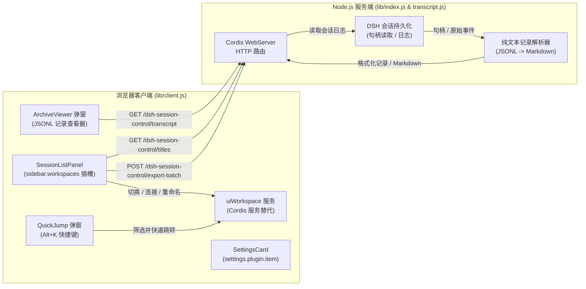

# 📦 @goodandready/dsh-session-control

<div align="center">

<h3>面向 DeepSeek Harness 的高级会话侧边栏管理：会话置顶、全文检索与归档查看器</h3>

<p align="center">
  <a href="https://www.npmjs.com/package/@goodandready/dsh-session-control"></a>
  <a href="LICENSE"></a>
  <a href="https://github.com/topics/dsh-plugin"></a>
  <a href="https://nodejs.org"></a>
</p>

<!-- 作者全部项目 -->
<p align="center">
  <a href="https://goodandready.app/"></a>
</p>

<p align="center">
  <a href="README.md"><b>🇬🇧 English</b></a> •
  <a href="README.zh.md"><b>🇨🇳 中文说明</b></a> •
  <a href="README.ru.md"><b>🇷🇺 Русский</b></a>
</p>

<!-- 强制性项目支持模块 -->
<table align="center">
  <tr>
    <td align="center">
      ⭐ <strong>如果您喜欢这个插件，请在 GitHub 上为它点亮 Star</strong> — 这能让我知道插件对您有用，并鼓励我继续开发和维护它。
      <br><br>
      🐛 <strong>如果您发现 Bug 或希望增加功能</strong>，请使用任意语言在 GitHub 上提交 Issue — 我会评估您的建议，并在后续版本中实现有价值的改进。
    </td>
  </tr>
</table>

</div>

---

## 插件对侧边栏的改造

本插件**替换了侧边栏的主体内容**——即工作区与会话列表部分。侧边栏的其他原生部分完全保持原样：品牌标识、新建会话按钮、底部状态栏以及设置导航入口均不受影响。

替换是架构上的必然要求：Harness 核心将 `sidebar.workspaces` 插槽声明为 `kind: "single"`，不允许注册多个并列组件，且侧边栏主体没有其他扩展插槽。

---

## 架构与数据流



## 功能对比：原生侧边栏 vs dsh-session-control

| 功能特性 | 原生侧边栏 | `dsh-session-control` |
|---|---|---|
| **会话置顶 (Pin)** | ❌ 无 | ✅ 顶部全局置顶区，统一管理 |
| **归档视图 (Archive)** | ❌ 完全不可见 | ✅ 独立归档分区，按时间段折叠聚合 |
| **阅读归档会话** | ❌ 无法打开 | ✅ 只读完整会话转录记录弹窗 |
| **内容搜索结果** | ⚠️ 仅显示标题 | ✅ 标题 + 匹配内容上下文摘要预览 |
| **空白会话** | ⚠️ 与活跃会话混杂 | ✅ 自动隐藏无消息会话（当前会话除外） |
| **批量操作** | ❌ 无 | ✅ 复选框多选及 Shift+Click 范围批量操作 |
| **可逆隐藏** | ❌ 仅支持不可逆归档 | ✅ 一键可逆隐藏与恢复 |
| **活跃运行指示** | ❌ 无指示 | ✅ 实时运行脉冲状态圆点 |
| **就地快速重命名** | ⚠️ 弹窗修改 | ✅ 双击标题或按 F2 直接在行内重命名 |
| **跨文件夹分组** | ❌ 无法实现（归属由工作目录推导） | ✅ 独立标签，不受文件夹限制 |
| **会话名称** | ⚠️ 未命名会话一律显示项目目录名 | ✅ 取自你在该会话中的第一条消息 |
| **键盘导航** | ❌ 无 | ✅ `Alt+K` 快速跳转，活跃与归档会话通搜 |
| **导出内容** | ❌ 无法带走 | ✅ 复制或保存为 Markdown |

> 原生 Harness 核心功能（工作区目录、深度会话搜索、会话分支等）完全保留：插件复用并强化了核心能力，而非重复造轮子。

---

## 安装方法

通过 `dsh` CLI 为 web profile 安装：

```bash
dsh plugin --profile web add @goodandready/dsh-session-control
```

重启 DeepSeek Harness web profile 以应用 bundle patch。

---

## 恢复原生侧边栏

随时可以通过卸载命令恢复默认侧边栏：

```bash
dsh plugin --profile web remove @goodandready/dsh-session-control
```

原生 `ui-workspace` 模块将立即恢复启用，侧边栏恢复默认外观。所有置顶和隐藏配置安全保留在宿主存储中，重新安装插件后自动恢复。

---

## 核心功能

### 📌 会话置顶 (Pinned Sessions)
将高频核心对话置顶在侧边栏最上方的全局置顶区。由于配置存储在宿主端，置顶状态在页面刷新、更换浏览器或跨设备访问时均能持久保持。

### 🔍 上下文片段搜索 (Search with Snippets)
核心支持对话内容全文检索，`dsh-session-control` 在搜索结果中提取并展示匹配文本的上下文摘要行，无需打开会话即可快速确认匹配细节。

### 🗄️ 按时间段归档聚合 (Period-Based Archive)
归档会话按 *今天*、*本周*、*本月*、*更早* 进行分组折叠展示。折叠的时间段不会在 DOM 中渲染，即使存在数千个历史会话也不会造成界面卡顿。搜索时命中的时间段会自动展开。

### 📜 只读归档转录查看器 (Archived Transcript Viewer)
在核心中已归档的会话无法直接进入对话模式。插件通过独立服务端路由 `GET /dsh-session-control/transcript?session=<id>` 提供安全的只读转录弹窗，方便查阅历史对话与工具调用。

### 🧹 自动隐藏空白会话 (Hide Blank Sessions)
定时调度、消息网关及看板插件会持续创建无消息会话。插件默认自动隐藏空白会话，保持侧边栏整洁清爽。当前正在使用的会话即使为空也绝不会被隐藏。可在设置中自定义开启或关闭。

### 👁️ 可逆隐藏 (Reversible Hiding)
区别于核心单向的归档机制，插件提供轻量级的可逆隐藏功能，方便随时收起或恢复会话。

### ☑️ 多选与批量操作 (Batch Operations)
悬停复选框与 Shift 键区间连选，支持批量隐藏、批量取消隐藏及批量置顶。

### 🏷️ 标签 (Labels)
会话无法在工作文件夹之间移动：文件夹就是主机上的目录，归属由会话的工作目录推导，内核会拒绝
路径不符的会话。标签提供了文件夹给不了的分组维度：可在行菜单中为单个会话添加，也可一次性
作用于所选的一批；点击列表上方的标签即可只保留该标签的会话，归档会话同样在内。当最后一个
会话被移除后，标签会自动消失。移除同样在该菜单中完成：条目直接写作「从「名称」中移除」，
而不是藏在一个对勾里。启用某个标签筛选时，还可在批量操作栏中一次性将该标签从所选会话上移除。

### 🧾 取自首条消息的名称 (Derived Names)
没有存储标题时，内核显示项目目录名，于是同一文件夹下的会话看起来完全一样。插件读取你在该
会话中发出的第一条消息作为名称。不调用模型，也不产生费用：文本本就在会话日志里。手动重命名
始终优先——一旦命名，推导出的名称即刻让位。只解析当前显示的行，因此折叠的分区没有任何开销。

### ⌨️ 快速跳转 (`Alt+K`)
在界面之上打开搜索窗口，同时按标题和消息内容检索。使用 `Alt` 而非 `Ctrl`：浏览器会独占
`Ctrl+K`，不会把它交给页面。西里尔字母键盘布局同样已适配。方向键移动，`Enter` 打开，`Esc` 关闭并把
焦点交还原处。归档结果以只读转录方式打开，与在列表中点击一致。

### 🚦 会话大小标记 (Session Size Badges)
DSH 的对话视图会把会话的全部事件同时保留在页面中。在超大会话里，长时间运行的智能体回合可能让浏览器
标签页完全卡死，同一站点的其他 DSH 标签页也会一起卡住。现在列表会提前提醒：会话较大时显示**黄色**
标记，已危及界面时显示**红色**标记。标记上以文字显示事件数，含义不只依赖颜色，悬停提示还会显示日志
大小。大小取自会话元数据，不会为此解压日志。默认阈值为 1 500 和 3 000 个事件，可在设置卡片中修改。

### ↪️ 在新会话中继续 (Continue in a New Session)
行菜单中的 **“在新会话中继续”** 会在同一工作区打开新对话，并在输入框中放入一份**草稿**：旧会话的名称
和工作区、你最近的请求以及智能体的最后一份报告。不会自动发送——由你阅读、修改后自行发送。摘录即时生成，
无需模型。

**“用模型总结后在新会话中继续”** 以模型撰写的总结代替摘录：目标、已完成、待办、约定与关键引用。它会消耗
模型令牌，因此只在明确点击时运行，并在设置卡片中配置提供商和模型之前保持禁用。超大会话不会整体交给模型：
只取预算范围内最新的部分，总结中会明确说明。

### 📤 Markdown 导出 (Export)
转录窗口可将会话复制到剪贴板，或保存为 `.md` 文件。被截断的转录会在导出内容中明确标注，避免
把片段误当作完整对话。

### ✏️ 就地快速重命名 (In-Place Rename)
双击会话标题或按下 `F2` 快捷键即可直接在列表中重命名。

---

## 配置项

前往 **设置 → 插件 → 插件设置 → 会话控制 (dsh-session-control)**：

| 字段 | 类型 | 默认值 | 说明 |
|---|---|---|---|
| `pinned` | `string[]` | `[]` | 置顶会话 ID 列表（数组顺序决定展示顺序） |
| `hidden` | `string[]` | `[]` | 可逆隐藏的会话 ID 列表 |
| `hideBlank` | `boolean` | `true` | 是否自动隐藏无消息的空白会话 |
| `sizeWarnEvents` | `number` | `1500` | 行显示黄色大小标记的事件数起点 |
| `sizeDangerEvents` | `number` | `3000` | 行显示红色大小标记的事件数起点 |
| `handoffProvider` | `string` | `''` | 模型总结使用的提供商 ID；留空则禁用 |
| `handoffModel` | `string` | `''` | 模型总结使用的模型 ID；留空则禁用 |
| `handoffMaxInputChars` | `number` | `60000` | 交给总结模型的对话记录预算（字符） |
| `handoffTimeoutSeconds` | `number` | `90` | 模型调用超时（秒） |
| `labels` | `Record<string, string[]>` | `{}` | 标签名称与其包含的会话 ID |

所有设置均持久保存在宿主端并在所有客户端间同步。

---

## 设计约束说明

* **不支持跨工作区移动会话：** 工作区与本地磁盘目录绑定，会话归属由其工作目录 (`cwd`) 决定，核心注册表严格校验路径一致性。
* **不支持从归档恢复：** Harness 核心目前仅提供归档接口，未提供反归档 API。归档会话可通过转录查看器安全只读查阅。
* **早期日志格式兼容：** 早期格式的历史日志若无法被核心反序列化，插件会展示清晰说明提示，避免错误显示为“无消息”。
* **不支持物理硬删除：** 核心公共接口未开放硬删除方法，插件严格遵循安全规范。

---

## HTTP API 路由参考

插件的服务端通过 Cordis `webServer` 提供以下三个 HTTP 接口：

| 方法 | 路由 | 查询参数 / 请求体 | 响应格式 | 说明 |
|---|---|---|---|---|
| `GET` | `/dsh-session-control/transcript` | `session=<id>`, `format=<json\|md>`, `title=<str>` | JSON 或 Markdown | 通过句柄读取会话 JSONL 日志，返回结构化消息事件（角色、文本、工具调用）或格式化 Markdown。 |
| `GET` | `/dsh-session-control/titles` | `sessions=<id1,id2,...>` | JSON `{"ok": true, "titles": { "<id>": "<标题>" }}` | 从用户的第一条发言中推导会话标题（单次最多 60 个 ID，进程内存缓存）。 |
| `POST` | `/dsh-session-control/export-batch` | 请求体: `{"sessions": [{"id": "...", "title": "..."}]}` | Markdown (`text/markdown`) | 批量导出多个会话并生成带有目录的统一 Markdown 文档。 |

## 架构与可靠性

插件采用严谨的**双半区架构**设计以确保最高可靠性：

1. **服务半区 (`uiWorkspace` 提供者):**
   * 被替换的原生 `ui-workspace` 负责导出核心服务 `uiWorkspace`，该服务是 `dsh-client-ui-sidebar` 和 `dsh-client-ui-conversation` 的强依赖项。
   * 插件的服务半区以零 React 渲染、零额外逻辑的极轻量方式提供该服务与根 Hooks。
2. **界面半区 (UI & Views):**
   * 包含工作区树、搜索列表、转录弹窗及设置卡片。
   * 完全由错误边界 (Error Boundaries) 保护，即使 UI 发生异常也不会影响侧边栏其他部分及主聊天界面的正常运行。
3. **服务端路由:**
   * 提供 `GET /dsh-session-control/transcript` 路由，安全解析并流式读取归档 JSONL 日志。

---

## 语言与本地化

插件核心内置英语文本。俄语及中文等多语言支持通过语言包扩展（如 `@goodandready/dsh-russian-lang`）。词典注册具备容错保护，不会因冲突引发异常。

---

## 兼容性

- 经验证支持 DeepSeek Harness `0.1.2-rc.1` 与 `0.1.3-alpha.1`。
- 支持 Node.js `^20.19.0` 或 `>=22.12.0`。
- 与 `@goodandready/dsh-lanmode`、`@goodandready/dsh-kanban`、`@goodandready/dsh-cron` 等 DSH 插件无缝协同工作。

---

## 许可证

MIT © GoodAndReady
